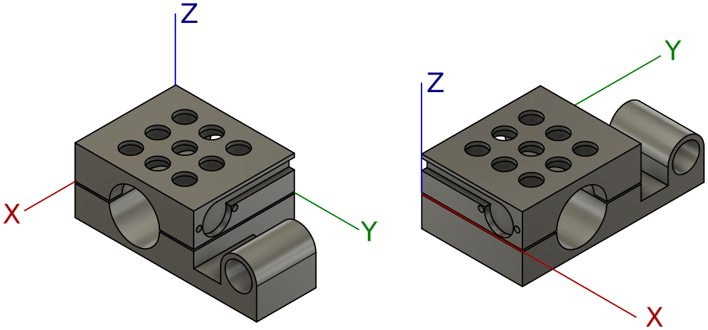

# Rally Switch (Beta)

Vaším úkolem je namodelovat „Rally Switch“ pro ovládání roadbooku
na motocyklové závody.

Na obrázku vidíte, jak taková věc vypadá ve skutečnosti.


Budete modelovat zjednodušenou variantu.


## Odevzdání a termíny

**Toto je beta verze zadání.**
To znamená, že se ještě může upřesňovat,
případně může dojít k opravě chyb a nepřesností,
ale podstata zadání již zůstane stejná.

Založte repozitář: https://classroom.github.com/a/LKcC_B9v

Deadline odevzdání je **21.12.2018 23:59 CET**.
Vypracovaný úkol nahrajte do repozitáře vytvořeného na odkaze výše.
Nikam jinam jej neposílejte, jako odevzdání se počítá to,
co bude ve vašem repozitáři (ve výchozí větvi (většinou master))
v momentu deadlinu.

Pokud máte jakékoliv dotazy, či naleznete chyby, napište je prosím do
[Issues](https://github.com/3DprintFIT/B181HW-Assignment/issues) v tomto repozitáři.

Po pushnutí commitu do vašeho repozitáře proběhne sada testů.
V současné verzi je testů málo, budou postupně přibývat až do 21.11.
Testy vyžadují optickou kontrolu.

## Rozhraní

Váš model implementujte jako modul v OpenSCADU s tímto rozhraním:

```scad
module rally_switch(
    buttons=[3,3],
    bar_diameter=28,
    bottom_base_height=3,
    button_bottom_access=12,
    button_diameter=10,
    button_edge_spacing=[8,13],
    button_lock_rim_height=2,
    button_spacing=[5,5],
    cut=1,
    joystick_diameter=15,
    joystick_wall_thickness=3,
    mounting_screw_diameter=4,
    mounting_screw_head_depth=5,
    mounting_screw_head_diameter=6,
    switch_cable_hole_depth=3,
    switch_cable_hole_diameter=16,
    switch_cable_hole_width=6,
    switch_height=15,
    switch_screw_depth=4,
    switch_screw_diameter=3,
    switch_screw_distance_from_edge=3,
    switch_screw_distance_from_top=10,
    switch_screw_spacing=20,
    top_base_height=5,
    show_bottom=true,
    show_top=true,
    )
{
    // ...
}
```

Smíte (je to dokonce žádoucí) vytvářet další pomocné moduly.
Smíte vytvářet další pomocné soubory (ale není to potřeba).

Váš modul musí jít použít následujícím způsobem z jiného souboru ve vašem
kořenovém adresáři vašeho repozitáře:

```scad
use <rally_switch.scad>

rally_switch();
```

Výchozí hodnoty argumentů musí zůstat zachovány dle tohoto rozhraní!
Naše testy budou jednotlivé argumenty nastavovat,
ale budou předpokládat stejné výchozí hodnoty!


## Parametry

Vámi namodelovaný model se bude skládat ze dvou částí: _bottom_ a _top_.
Pomocí argumentu `show_bottom` (respektive  `show_top`) lze zobrazení těchto
částí vypnout (respektive zapnout).
Nezobrazení jedné části nemá vliv na pozici části zobrazené.

Parametr `buttons` určuje počet děr na tlačítka (část _top_) ve směru os X a Y.
Další dvousložkové parametry se chovají stejně
(první složka udává rozměr po ose X, druhá po ose Y).

Všechny další parametry udávají rozměry jednotlivých součástí dle přiložených
schémat.


## Umístění v souřadném systému

Pro automatické testy je naprosto zásadní,
aby váš model byl umístěn na správném místě.
**Modely umístěné špatně budou vyhodnoceny jako nesprávné.**
Věnujte proto umístění modelu zvýšenou pozornost.

Model leží v nezáporných částech os X a Y počínaje v nulách.

Model leží středem předělu mezi částmi _bottom_ a _top_ na rovině XY
(tedy na Z=0).




## Horní díl (část _top_)


Schémata lze zvětšit. V repozitáři jsou i vektorové varianty.

## Spodní díl (část _bottom_)


## Celek


Na obrázku si všiměte úchytu na joystik a jeho zarovnání na předposlední (počítáno od Z=0) díru na tlačítko.
Situaci, kdy je `holes.x` méně než 2, nemusíte řešit.


## Nefunkční požadavky

  - Manipulace s `$f*` hodnotami je zakázána
  - Je zakázáno použít konstrukci `minkowski()` (ve 3D i ve 2D prosotoru)
  - Není doporučováno používat rekurzi, ani to k vyřešení úkolu není zapotřebí
  - Využití externích knihoven (včetně knihovny MCAD) je zakázáno
  - Pokud je něco **zakázáno**, vede použití k tomu, že **neprojdou testy** a dostáváte **0 bodů**
  - Váš kód musí splňovat určitou kvalitu (**tato část tvoří 5 bodů z celkových 30 možných**)
    - Opakování v kódu je špatně, vždy použijte moduly a cykly
    - Bulharské konstanty musí být doplněny o vysvětlující komentář
    - Dodržte logickou úroveň odsazení

